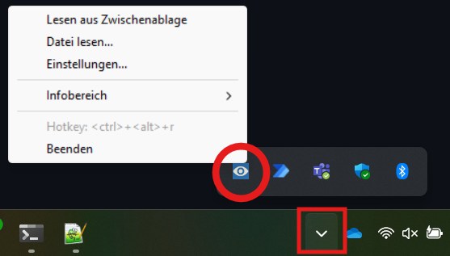
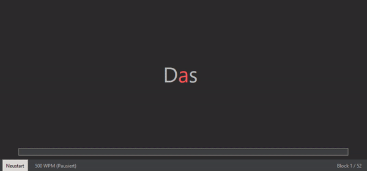

# SpeedReader (RSVP-Anwendung)

**SpeedReader** ist eine schnelle, leichtgewichtige Windows-Desktop-Anwendung, die das Lesen von Texten mithilfe der **RSVP-Methode** (*Rapid Serial Visual Presentation*) effizienter und augenschonender gestaltet.  
Die App funktioniert **ohne Administratorrechte**, läuft im Hintergrund im System-Tray und zeigt Wörter oder Wortgruppen sequenziell an einem festen Punkt auf dem Bildschirm an.

---

## 🖼️ Beispielansichten

  
*System-Tray mit aktiviertem Lesefenster*

  
*Wort-für-Wort-Wiedergabe mit 500 WPM*

---

## 🚀 Funktionen & Merkmale

### 📖 Kernfunktionalität (RSVP)

- **Wort-für-Wort-Anzeige**: Text erscheint zentriert, Wort für Wort oder in Gruppen (*Chunking*), um Augenbewegungen zu reduzieren.
- **Canvas-Rendering**: Pixelgenaue Darstellung durch ein Canvas-Widget.
- **Chunking**: Anzeige von 1–10 Wörtern gleichzeitig für besseren Lesefluss bei höheren Geschwindigkeiten.

---

### ⚙️ Geschwindigkeit & Timing

- **WPM-Steuerung**: Frei wählbar von **50 bis 1500 WPM**, über Schieberegler, direkte Eingabe oder `+`/`-`-Tasten (auch am Numpad).
- **Startverzögerung**: Einstellbare Wartezeit (in ms), bevor das erste Wort erscheint.
- **Satzzeichenpausen**: Zusätzliche Pausen (in ms) für:
  - Satzende (`.`, `!`, `?`, `:`)
  - Kommas (`,`)
  - Absätze (Leerzeilen)
- **Wortlängen-Bonus**: Optionale Extra-Anzeigezeit für lange Wörter (einstellbar nach Zeichenschwelle & Dauer).

---

### 👁️‍🗨️ Lesehilfen & Darstellung

- **Optimal Recognition Point (ORP)**:
  - Optionaler roter Fixationsbuchstabe (nur bei Chunk-Größe 1)
  - ORP-Position einstellbar (0–100 %)
  - Buchstabe erscheint zentriert im Fenster (Fixpunkt-Prinzip)

- **Kontextanzeige**:
  - Vorheriger/nächster Chunk optional sichtbar (vertikal oder horizontal)
  - Hinweis: ORP nur im vertikalen Layout aktiv

- **Kontext-Snippet**:
  - Durchlaufender Textauszug unterhalb des Lesefensters
  - Wird (falls aktiviert) nur im Pausenmodus angezeigt

---

### 🎨 Anpassbares Aussehen

- Frei wählbare **Schriftart** und **Größe**
- Anpassbare Farben für Text, Hintergrund und ORP (im Hellmodus)
- **Dark Mode** mit vordefiniertem Farbschema
- Optional **rahmenloses Fenster** und **Immer-im-Vordergrund-Modus**

---

## 🖱️ Bedienung & Integration

### 💻 System-Integration

- **Läuft im Hintergrund** mit Tray-Icon im Infobereich
- **Tray-Menü**:
  - Lesen aus Zwischenablage
  - Lesen aus Datei (`.txt`, `.docx`, `.pdf`)
  - Einstellungen
  - Info (Version, Autor, GitHub-Link)
  - Beenden

- **Globaler Hotkey**:
  - Standard: `Strg + Alt + R`
  - Startet direkt das Lesen aus der Zwischenablage

- **Unterstützte Dateiformate**:
  - `.txt`
  - `.docx`
  - `.pdf`

### 🧭 Steuerung im Lesefenster

| Taste               | Funktion                                                             |
|--------------------|----------------------------------------------------------------------|
| Leertaste           | Pause / Fortsetzen                                                   |
| Escape              | Fenster schließen                                                    |
| Pfeil Links         | Zum Anfang des aktuellen Satzes springen (wiederholt = vorheriger)   |
| Pfeil Rechts        | Zum nächsten Satz springen                                           |
| `+` / Numpad `+`    | Geschwindigkeit erhöhen (+10 WPM)                                    |
| `-` / Numpad `-`    | Geschwindigkeit verringern (–10 WPM)                                 |
| Enter / Numpad Enter| Fenster schließen bei "`--- Ende ---`"                               |

---

## 💾 Installation

1. Lade die neueste `SpeedReader.exe` von der [Releases-Seite](https://github.com/leofleischmann/Windows-Speed-Reader-RSVP/releases) herunter.
2. Verschiebe die Datei in einen beliebigen Ordner.
3. **Starte `SpeedReader.exe`** per Doppelklick.
4. Die Anwendung startet im Hintergrund und erscheint im Infobereich (Tray).

> ✅ **Keine Installation, keine Administratorrechte und keine Internetverbindung nötig.**

---

## 🧠 Weitere Features

- **Einstellungen speichern**: Alle Konfigurationen dauerhaft unter:  
  `%APPDATA%\SpeedReader\`

- **Autostart (optional)**: Aktivierbar in den Einstellungen – startet SpeedReader automatisch mit Windows.

- **Einzelinstanz-Schutz**: Mehrfache Starts werden verhindert (via Lock-Datei mit PID-Prüfung).

---

## 💡 Mitwirken

Feedback, Vorschläge und Bug-Reports sind herzlich willkommen!  
👉 Öffne ein [Issue](https://github.com/leofleischmann/Windows-Speed-Reader-RSVP/issues) oder erstelle einen Pull Request.

---

## ❗ Bekannte Einschränkungen

- Die Texterkennung in **PDF-Dateien** kann bei komplexem Layout oder Sonderzeichen unzuverlässig sein.
- **ORP funktioniert nur** bei **lateinischer Schrift**.
- Bei **sehr langen Texten** kann das Einlesen leicht verzögert starten.

---

## 🔍 Hinweis zur Code-Erstellung

> Der Großteil des Quellcodes (ca. 99 %) wurde mithilfe von **Gemini (Google AI)** erstellt und anschließend iterativ angepasst und erweitert.

---
